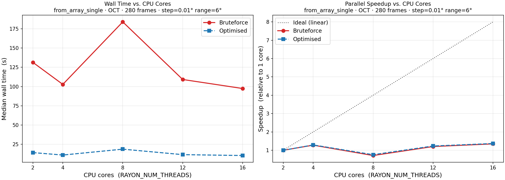

Benchmarks
==========

All benchmarks were run on an Intel Xeon Gold 6234 (8 physical cores, 16 logical
processors via HyperThreading) under WSL2.  Example data shipped with the package
was used throughout: the IVUS rest/stress pullbacks for the step-size benchmark
and the OCT pullback (280 frames) for the parallelization benchmark.

.. _benchmark-algorithm:

1. Algorithmic improvement: bruteforce vs. optimized
-----------------------------------------------------

The optimized alignment algorithm uses a coarse-to-fine hierarchical search
instead of evaluating every candidate angle exhaustively.  The effect is small
at coarse step sizes (few angles to evaluate) but grows rapidly as the step size
decreases, because the number of candidate angles scales as
:math:`n = 2 \times \text{range} / \text{step}`.

**Test setup** — ``from_file_full`` on the IVUS rest/stress example data,
``range_rotation_deg = 90°``, ``write_obj = False``, ``smooth = False``,
``postprocessing = False``.  Three repetitions per condition; median wall time
reported.

.. figure:: ../benchmarks/results/bruteforce_stepsize.png
   :name: fig-benchmark-stepsize
   :alt: Bruteforce vs. optimized alignment wall time and speedup across step sizes
   :align: center
   :width: 900px

   Wall time (left, log-log) and speedup factor (right) of the optimized
   algorithm over bruteforce as a function of the rotation step size.
   The O(n) reference line confirms the linear scaling of bruteforce with the
   number of candidate angles; the optimized search is sub-linear.

At step sizes of 1° and above the difference is modest (< 2x).  Below 1° the
gap widens substantially: at **0.1°** the optimized algorithm is **5.5x faster**
and at **0.05°** the advantage grows to **10.3x** (6.25 s vs. 64.4 s).  This is
the practically relevant regime: fine step sizes are required for high-accuracy
alignment of OCT data and dense IVUS pullbacks.

.. _benchmark-parallelization:

2. parallelization scaling
--------------------------

The second benchmark tests how much additional speed is gained by increasing
the number of CPU cores, using ``from_array_single`` on the OCT dataset
(280 frames, ``step_rotation_deg = 0.01°``, ``range_rotation_deg = 6°``).
Each core count was run in a fresh subprocess so that rayon's global thread
pool re-initialises from ``RAYON_NUM_THREADS``.

.. list-table:: Median wall time (s) across CPU core counts
   :header-rows: 1
   :widths: 12 20 20 18 18

   * - Cores
     - Bruteforce (s)
     - optimized (s)
     - Alg. speedup
     - Core scaling (opt.)
   * - 2
     - 92.36
     - 10.08
     - 9.2x
     - 1.00x (baseline)
   * - 4
     - 46.78
     - 5.56
     - 8.4x
     - 1.81x
   * - 8
     - 24.27
     - 3.49
     - 7.0x
     - 2.89x
   * - 12
     - 16.74
     - 2.64
     - 6.3x
     - 3.82x
   * - 16
     - 14.15
     - 2.40
     - 5.9x
     - 4.20x

**Key observations**

* Parallelizing the angle search inside ``search_range`` (rather than the
  point-rotation loop) provides enough rayon tasks per frame to utilise cores
  effectively: bruteforce scales **6.5x** from 2 to 16 cores, optimized
  scales **4.2x** — both close to practical expectations under Amdahl's law
  given the sequential frame-dependency chain.

* The previous 8-core anomaly (WSL2 HyperThreading interference) has
  disappeared.  With hundreds of angle-evaluation tasks per frame, rayon
  keeps all workers busy and the idle HT sibling effect is negligible.

* The optimized algorithm remains **5.9-9.2x faster** than bruteforce at
  every core count, with the gap slightly narrowing at higher core counts
  because bruteforce has more angles to parallelize and therefore scales
  more aggressively.

* The two gains **compound**: relative to bruteforce at 2 cores (92.4 s),
  the optimized algorithm at 16 cores (2.40 s) achieves a combined
  **38.5x speedup** — roughly 9x from the algorithm and 4x from parallelization.

**Conclusion** — algorithm choice and hardware scaling are now both meaningful
levers.  For the best achievable throughput, use the optimized algorithm on as
many cores as available; for rapid prototyping where accuracy matters less,
coarser step sizes reduce runtime regardless of core count.

.. _benchmark-ccta-spatial:

3. CCTA pipeline: spatial indexing and Rust migrations
--------------------------------------------------------

The CCTA labeling/stitching pipeline (``label_geometry``, ``stitch_ccta_to_intravascular``)
originally spent most of its time in brute-force O(N × M) point/face searches (every mesh
vertex checked against every centerline point, every excluded face, or every other point in a
cleanup set) and in several pure-Python per-vertex/per-face loops.  Both problems were fixed
by (a) replacing the brute-force searches with R-tree spatial indexes (`rstar
<https://docs.rs/rstar>`_) and (b) moving the remaining hot pure-Python loops into Rust.

**Test setup** — reference dataset ``NARCO_119.stl`` (25,171 vertices, 50,338 faces) with
matched aorta/RCA/LCA centerlines, ``anomalous_rca=True``.  All "before"/"after" pairs below
were measured on identical input; the two rows marked with † also benefited from a debug →
release Rust build correction found partway through the optimization pass, so their ratio
somewhat overstates the isolated algorithmic contribution — every other row is a fair
comparison regardless of build type (either both sides are the same build, or the "before"
side is pure Python/NetworkX, where build type doesn't apply).

.. list-table:: Per-function before/after wall time
   :header-rows: 1
   :widths: 26 34 12 12 10

   * - Function
     - What changed
     - Before
     - After
     - Speedup
   * - ``find_centerline_bounded_points_simple``
     - Nested-loop O(N×M) → R-tree over centerline points, O((N+M) log M)
     - 22.4 s
     - 0.236 s
     - ~95×
   * - ``find_faces_near_points`` (replaces ``_find_faces_for_points`` /
       ``_prepare_faces_for_rust``)
     - Python O(N×M) nearest-vertex scan → Rust, R-tree over mesh vertices
     - 3.184 s
     - 0.025 s
     - ~127×
   * - ``fix_mesh_winding`` (via ``_fast_fix_normals``, replaces
       ``trimesh.Trimesh.fix_normals()``)
     - Python/NetworkX BFS over face-adjacency graph → Rust BFS (same algorithm,
       verified byte-for-bit identical output)
     - 3.898 s
     - 0.105 s
     - ~37×
   * - ``final_reclassification`` (replaces ``_final_reclassification``)
     - Python per-vertex adjacency-based label loop → Rust
     - 0.293 s
     - 0.043 s
     - ~7×
   * - ``find_aortic_points`` (replaces ``_find_aortic_points``, pre- +
       post-clean combined)
     - Python per-vertex set-difference loop → Rust, exact-match hash lookup
     - 0.217 s
     - 0.063 s
     - ~3.4×
   * - ``clean_outlier_points`` †
     - Two nested O(N×(N+M)) linear scans → R-trees over both point sets
     - 1.28 s
     - 0.04 s
     - ~32×
   * - ``remove_occluded_points_ray_triangle`` (face-exclusion pass) †
     - Point-vs-excluded-face linear scan → R-tree over excluded faces' vertices
     - 4.35 s
     - 0.04 s
     - ~99×
   * - Full example pipeline (``examples/fullworkflow.py``, end to end)
     - All of the above, cumulative, plus the debug → release build correction
     - ~190 s
     - ~24 s
     - ~8×

**Key observations**

* The largest single win is ``find_centerline_bounded_points_simple``: swapping a brute-force
  rolling-sphere check for an R-tree query over the (much smaller) centerline point set turns
  an O(N × M) scan into O((N + M) log M) — a ~95× reduction on its own, with no change in
  output.
* Several hotspots were pure-Python loops doing real per-vertex/per-face work
  (nearest-vertex search, adjacency traversal, set differences, mesh-winding correction).
  Moving each into a Rust binding removed the Python interpreter overhead entirely,
  independent of the R-tree question — ``fix_mesh_winding`` in particular is a faithful Rust
  port of `trimesh <https://trimesh.org/>`_'s own ``repair.fix_winding`` BFS algorithm, not a
  different algorithm, and its output was checked byte-for-bit against trimesh's directly.
* Not every brute-force search was worth optimizing: ray-triangle intersection testing in
  ``remove_occluded_points_ray_triangle`` (the "Pass A" ray-casting step, distinct from the
  face-exclusion pass in the table above) dropped to a non-bottleneck once the release-build
  correction landed, so it was deliberately left as a plain nested loop — it reads more
  clearly than a BVH/AABB-pruned version would, and optimizing further would not have moved
  the total pipeline time.

**Conclusion** — for point-cloud and mesh-topology operations of this kind (nearest-neighbor
search, radius queries, exact-match set operations, adjacency traversal), the two effective
levers are (1) replace any brute-force all-pairs search with a spatial index built over the
smaller side, and (2) if a hot loop is doing real per-item work in pure Python — including
inside a third-party library — port it to Rust rather than trying to vectorize it away in
NumPy.
