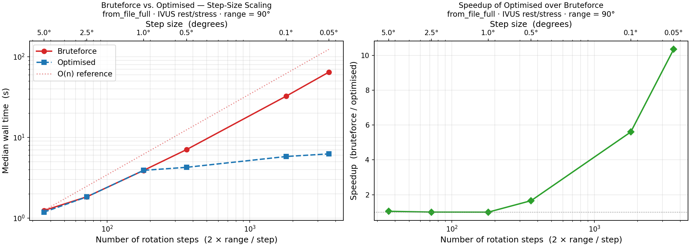

Benchmarks
==========

All benchmarks were run on an Intel Xeon Gold 6234 (8 physical cores, 16 logical
processors via HyperThreading) under WSL2.  Example data shipped with the package
was used throughout: the IVUS rest/stress pullbacks for the step-size benchmark
and the OCT pullback (280 frames) for the parallelization benchmark.

.. _benchmark-algorithm:

1. Algorithmic improvement: bruteforce vs. optimized
-----------------------------------------------------

The optimized alignment algorithm uses a coarse-to-fine hierarchical search
instead of evaluating every candidate angle exhaustively.  The effect is small
at coarse step sizes (few angles to evaluate) but grows rapidly as the step size
decreases, because the number of candidate angles scales as
:math:`n = 2 \times \text{range} / \text{step}`.

**Test setup** — ``from_file_full`` on the IVUS rest/stress example data,
``range_rotation_deg = 90°``, ``write_obj = False``, ``smooth = False``,
``postprocessing = False``.  Three repetitions per condition; median wall time
reported.

   Wall time (left, log-log) and speedup factor (right) of the optimized
   algorithm over bruteforce as a function of the rotation step size.
   The O(n) reference line confirms the linear scaling of bruteforce with the
   number of candidate angles; the optimized search is sub-linear.

At step sizes of 1° and above the difference is modest (< 2x).  Below 1° the
gap widens substantially: at **0.1°** the optimized algorithm is **5.5x faster**
and at **0.05°** the advantage grows to **10.3x** (6.25 s vs. 64.4 s).  This is
the practically relevant regime: fine step sizes are required for high-accuracy
alignment of OCT data and dense IVUS pullbacks.

.. _benchmark-parallelization:

2. parallelization scaling
--------------------------

The second benchmark tests how much additional speed is gained by increasing
the number of CPU cores, using ``from_array_single`` on the OCT dataset
(280 frames, ``step_rotation_deg = 0.01°``, ``range_rotation_deg = 6°``).
Each core count was run in a fresh subprocess so that rayon's global thread
pool re-initialises from ``RAYON_NUM_THREADS``.

.. list-table:: Median wall time (s) across CPU core counts
   :header-rows: 1
   :widths: 12 20 20 18 18

   * - Cores
     - Bruteforce (s)
     - optimized (s)
     - Alg. speedup
     - Core scaling (opt.)
   * - 2
     - 92.36
     - 10.08
     - 9.2x
     - 1.00x (baseline)
   * - 4
     - 46.78
     - 5.56
     - 8.4x
     - 1.81x
   * - 8
     - 24.27
     - 3.49
     - 7.0x
     - 2.89x
   * - 12
     - 16.74
     - 2.64
     - 6.3x
     - 3.82x
   * - 16
     - 14.15
     - 2.40
     - 5.9x
     - 4.20x

**Key observations**

* Parallelizing the angle search inside ``search_range`` (rather than the
  point-rotation loop) provides enough rayon tasks per frame to utilise cores
  effectively: bruteforce scales **6.5x** from 2 to 16 cores, optimized
  scales **4.2x** — both close to practical expectations under Amdahl's law
  given the sequential frame-dependency chain.

* The previous 8-core anomaly (WSL2 HyperThreading interference) has
  disappeared.  With hundreds of angle-evaluation tasks per frame, rayon
  keeps all workers busy and the idle HT sibling effect is negligible.

* The optimized algorithm remains **5.9-9.2x faster** than bruteforce at
  every core count, with the gap slightly narrowing at higher core counts
  because bruteforce has more angles to parallelize and therefore scales
  more aggressively.

* The two gains **compound**: relative to bruteforce at 2 cores (92.4 s),
  the optimized algorithm at 16 cores (2.40 s) achieves a combined
  **38.5x speedup** — roughly 9x from the algorithm and 4x from parallelization.

**Conclusion** — algorithm choice and hardware scaling are now both meaningful
levers.  For the best achievable throughput, use the optimized algorithm on as
many cores as available; for rapid prototyping where accuracy matters less,
coarser step sizes reduce runtime regardless of core count.
