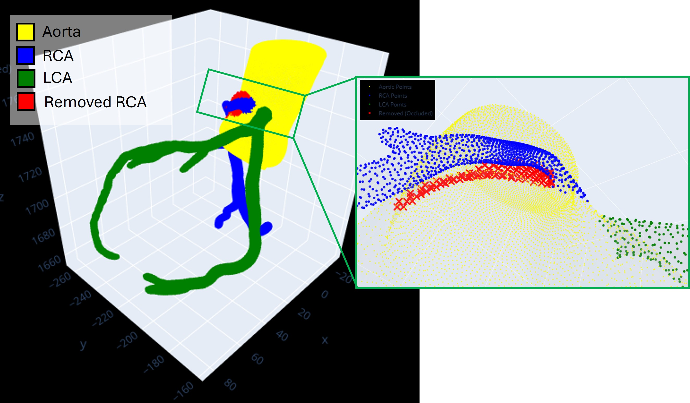
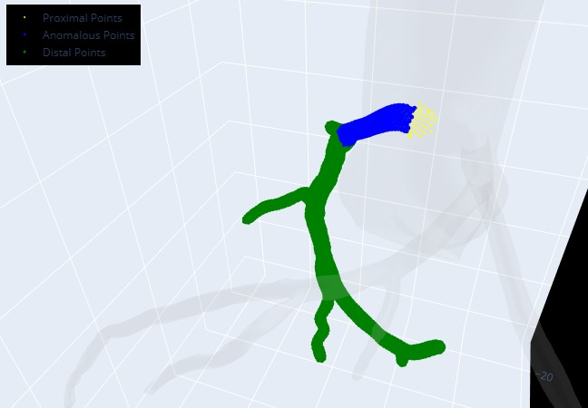
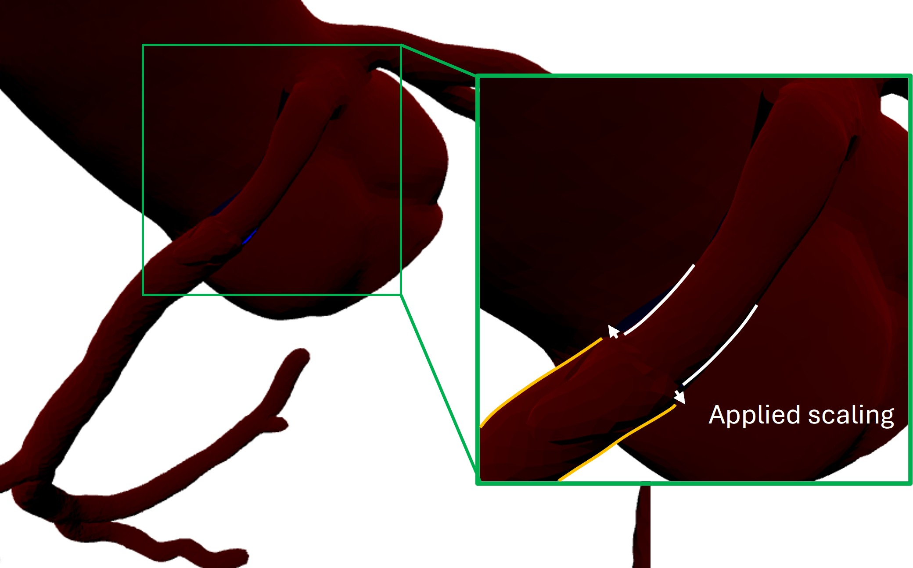

.. note::

    Also download the example data and jupyter notebooks from the current release from the
    `Github Releases page <https://github.com/yungselm/multimoda-rs/releases>`_ to follow
    this tutorial step-by-step.

Tutorial - CCTA Module
=======================

This step-by-step tutorial demonstrates how to:

- Read in and prepare .stl CCTA geometries and centerlines
- Label the newly created trimesh.Trimesh object based on an intravascular geometry
- Morph the newly labeled regions to match an intravascular geometry pair
- UNFINISHED: Fusion of CCTA and intravascular geometries

1. Read in and prepare CCTA geometries and centerlines
^^^^^^^^^^^^^^^^^^^^^^^^^^^^^^^^^^^^^^^^^^^^^^^^^^^^^^^
While CCTA mesh and centerline text files can be read in seperately, multimodars provides a conventient function
that combines both steps, and performs several checks. Additionally is the geometry automatically labeled.

.. code-block:: python

    import multimodars as mm

    results, (rca_cl, lca_cl, ao_cl) = mm.lable_geometry(
        path_ccta_geometry="../data/NARCO_119.stl",
        path_centerline_aorta="../data/centerline_aorta.csv",
        path_centerline_rca="../data/centerline_rca.csv",
        path_centerline_lca="../data/centerline_lca.csv",
        bounding_sphere_radius_mm=3.5, # rolling sphere radius for initial vessel labeling
        n_points_intramural=200, # points centerline to define end of intramural section, if unsure keep large
        anomalous_rca=True, # cleans wrongly labeled points intramural part
        anomalous_lca=False,
        control_plot=True,
    )

The control plot can be used to check the settings of the bounding_sphere_radius and n_points_intramural. Typically
the default values work well, however due to large variability in biology there parameters potentially need to be 
adjusted.

results is a dictionary with the following contents:
- "mesh": The CCTA geometry a trimesh.Trimesh object
- "aorta_points": The points labeled as aorta points [(x, y, z), ...]
- "rca_points": The points labeled as RCA points [(x, y, z), ...]
- "lca_points": The points labeled as LCA points [(x, y, z), ...]
- "rca_removed_points": The removed RCA points in the intramural course [(x, y, z), ...]
- "lca_removed_points": The removed LCApoints in the intramural course [(x, y, z), ...]

2. Labeling based on intravascular geometry
^^^^^^^^^^^^^^^^^^^^^^^^^^^^^^^^^^^^^^^^^^^^
The first advantage of this labeling is that a more precise alignment of the intravascular pseudo 3D geometry can
be performed.

.. code-block:: python

    rest, _ = mm.from_file_singlepair("data/ivus_rest", write_obj=False)

    aligned, resampled_cl = mm.align_combined(
        rca_centerline,
        rest,
        (12.2605, -201.3643, 1751.0554),
        (11.7567, -202.1920, 1754.7975),
        (15.6605, -202.1920, 1749.9655),
        results["rca_points"],
        angle_range_deg=10.0,
        write=True,
        watertight=True,
        output_dir="test",
    )

This algorithm first roughly aligns the intravascular geometry to the 3 landmark points (aortic, upper, lower),
but then uses the ccta points to optimize the rotation by hausdorff distances. It optimizes the rotation but also
allows for +/- 2 centerline points shifting of the aligned geometry.

After the alignment is performed, the CCTA mesh can additionally labeled for distal region, proximal region and 
anomalous region. This is in preparation for the fusion later but allows for handling of the different sections
differently.

The labeling is straightforward:

.. code-block:: python

    results = mm.label_anomalous_region(
        centerline=rca_centerline,
        frames=aligned.geom_a.frames,
        output_dir="test",
        debug_plot=True,
    )

The results dictionary is extended by the following keys:
- "proximal_points": The points proximal to the anomalous region [(x, y, z), ...]
- "distal_points": The points distal to the anomalous region [(x, y, z), ...]
- "anomalous_points": The points of the anomalous region [(x, y, z), ...]

3. Morphing CCTA to intravascular geometry
^^^^^^^^^^^^^^^^^^^^^^^^^^^^^^^^^^^^^^^^^^^^
If desired the distal and proximal regions of the CCTA geometry and additionally the aorta can be morphed to better match the intravascular geometry.
This is especially useful for future computational simulation, where a smooth geometry is desired.

The distal and proximal segment are radially scaled by finding the best scaling factor that minimizes the distance between the first/last frames of
the intravascular geometry with the first/last vertices of the proximal/distal region of the CCTA geometry.

.. code-block:: python

    prox_scaling, distal_scaling = mm.find_distal_and_proximal_scaling(
        frames=aligned.geom_a.frames,
        centerline=rca_cl,
        results=results,
        debug_plot=True,
    )

For the aortic scaling the distance between the aortic points and the wall of the anomalous geometry is iteratively minimized,
by applying a radial scaling to the aortic region. 

.. code-block:: python

    aortic_scaling = mm.find_aorta_scaling(
        frames=aligned.geom_a.frames,
        centerline=ao_cl,
        results=results,
        debug_plot=True,
    )

These calcualted scaling factors can then be used to morph the CCTA geometry, e.g.:

.. code-block:: python

    scaled_distal = mm.scale_region_centerline_morphing(
        mesh=results['mesh'],
        region_points=results['distal_points'],
        centerline=rca_cl,
        diameter_adjustment_mm=distal_scaling,
    )

Which will result in a morphed distal region like this:

