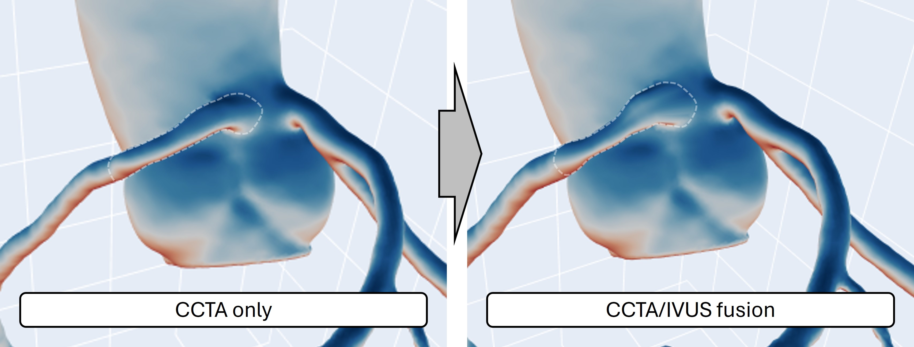
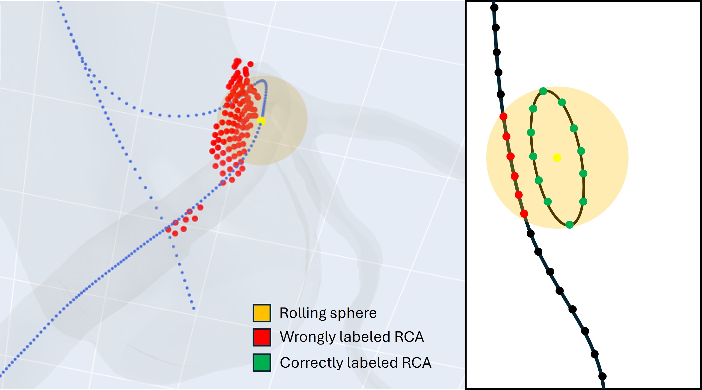
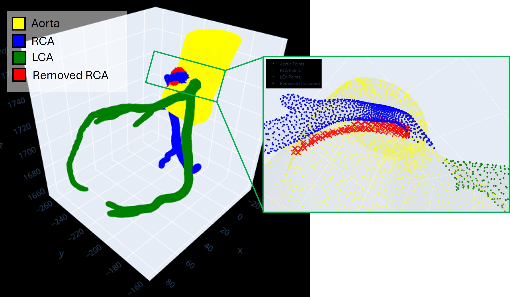
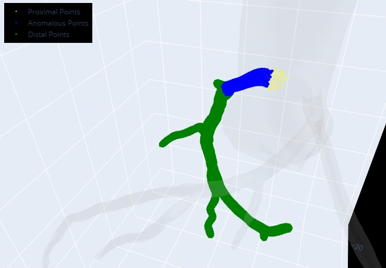
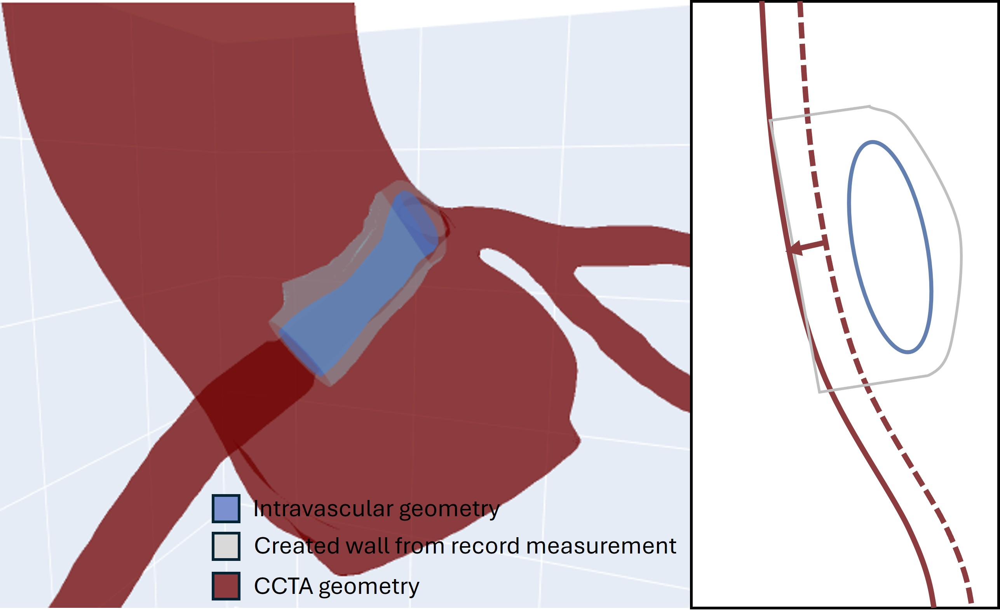
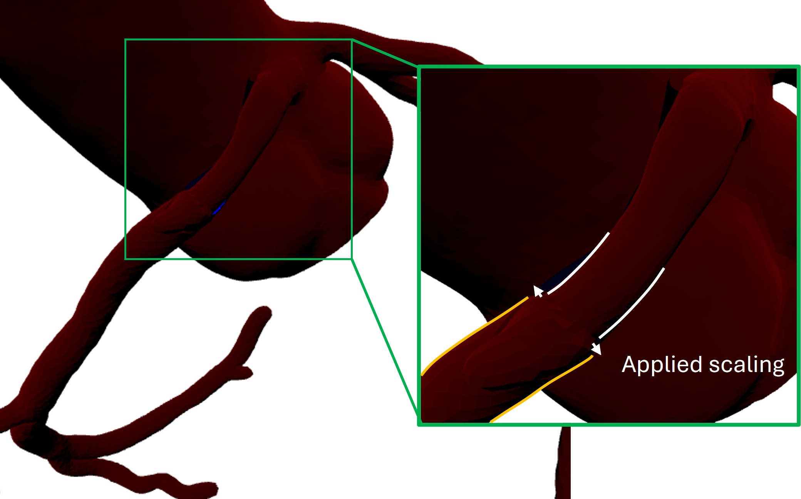

.. note::

    Example data and Jupyter notebooks are included in the repository under the ``examples/`` directory.
    You can also follow along in the :doc:`CCTA Notebook <notebooks/ccta_notebook>`.
    The ``stitching.py`` example script allows you to also display the trimesh debug plots.

Tutorial - CCTA Module
=======================

This step-by-step tutorial demonstrates how to:

1. Read in and label a CCTA geometry from an STL file and centerline CSV files
2. Load an intravascular geometry and fine-align it to the CCTA point cloud
3. Label the anomalous (intramural) region within the CCTA mesh
4. Compute radial scaling factors for the proximal, distal, and aortic regions
5. Morph the CCTA mesh to match the intravascular geometry
6. Remove the intramural region and stitch the CCTA to the intravascular geometry
7. Remesh and smooth the stitched geometry
8. Visualise labeled regions and export section STL files
9. Re-label the final stitched geometry

The goal of this module is to replace a section on the CCTA geometry with an intravascular geometry.

1. Read in and prepare CCTA geometries and centerlines
^^^^^^^^^^^^^^^^^^^^^^^^^^^^^^^^^^^^^^^^^^^^^^^^^^^^^^^

The entry point for the CCTA module is :func:`multimodars.label_geometry`, which reads a
triangulated surface mesh (STL) together with centerline CSV files for the aorta, the right
coronary artery (RCA), and the left coronary artery (LCA).  It returns a labeled results
dictionary and three :class:`multimodars.PyCenterline` objects that are used in all subsequent
steps.

.. code-block:: python

    import multimodars as mm

    results, (rca_cl, lca_cl, ao_cl) = mm.label_geometry(
        path_ccta_geometry="data/NARCO_119_noside.stl",
        path_centerline_aorta="data/centerline_aorta.csv",
        path_centerline_rca="data/centerline_rca_short.csv",
        path_centerline_lca="data/centerline_lca.csv",
        bounding_sphere_radius_mm=3.0,
        n_points_intramural=100,
        anomalous_rca=True,
        anomalous_lca=False,
        control_plot=False,
    )

**Core algorithm labeling:**

In the first step, a rolling sphere is propagated along the coronary centerlines. For anatomically normal coronary arteries, this approach reliably assigns all mesh vertices within the predefined radius to either the RCA or LCA label. In anomalous coronary arteries with an intramural course, however, the rolling sphere systematically mislabels a subset of aortic-wall vertices as coronary, owing to the compressed elliptic cross-section of the vessel and its proximity to the aortic wall (see :numref:`fig-rolling`).

   Rolling sphere applied for the case of an R-AAOCA, demonstrating incorrect labeling caused by the elliptic vessel cross-section. Left: 3-D view; right: schematic illustration.

To address this limitation, a ray-casting algorithm is employed. A ray is cast from each aortic centerline point toward each of the ``n_points_intramural`` proximal coronary centerline points. When a ray intersects three mesh faces, the first intersected face is added to an occlusion set. All RCA vertices that are topologically connected to any face in this set are subsequently reclassified as ``aortic_points`` and recorded in ``rca_removed_points``, removing them from the ``rca_points`` label. The identical procedure is applied symmetrically when ``anomalous_lca=True``.

.. list-table::
   :widths: 50 50
   :align: center

   * - .. image:: ./figures/ray_casting.gif
          :width: 100%
          :alt: Ray casting animation
     - .. image:: ./figures/ray_casting.jpg
          :width: 100%
          :alt: Ray casting diagram

*Left:* 3D visualization of all cast rays. *Right:* schematic diagram of the occlusion-detection step.

As a final clean-up, any RCA or LCA vertex whose immediate mesh neighbours carry no
same-label assignment — an island vertex disconnected from all other coronary-labeled
vertices — is reclassified as aortic. This adjacency-based elimination ensures that
the returned ``rca_points`` and ``lca_points`` sets form topologically connected regions
on the mesh surface.

**Parameter reference:**

- ``bounding_sphere_radius_mm``: radius of the rolling sphere used for the initial vessel
  labeling pass.  Larger values cast a wider net and capture more distant vertices; smaller
  values are more conservative.  The default of 3.5 mm works for most datasets; adjust
  downward if neighboring structures are incorrectly captured.
- ``n_points_intramural``: number of centerline points used to define the end of the
  intramural segment.  When uncertain, keep this value large; the anomalous-region labeling
  in step 3 will refine the boundary.
- ``anomalous_rca`` / ``anomalous_lca``: when ``True``, the algorithm removes incorrectly
  labeled intramural points from the respective vessel and reassigns them to
  ``"rca_removed_points"`` / ``"lca_removed_points"``.  Set to ``False`` for normal coronary
  anatomy.
- ``control_plot``: opens an interactive 3-D scene to inspect the labeling result.  Set to
  ``True`` when tuning ``bounding_sphere_radius_mm`` or ``n_points_intramural``.

The returned ``results`` dictionary contains:

- ``"mesh"`` — the CCTA geometry as a ``trimesh.Trimesh`` object.
- ``"aorta_points"`` — vertices labeled as aorta: ``[(x, y, z), ...]``.
- ``"rca_points"`` — vertices labeled as RCA: ``[(x, y, z), ...]``.
- ``"lca_points"`` — vertices labeled as LCA: ``[(x, y, z), ...]``.
- ``"rca_removed_points"`` — RCA vertices inside the intramural course that were removed from
  the RCA label: ``[(x, y, z), ...]``.
- ``"lca_removed_points"`` — same for LCA.

The centerline CSV files must contain three columns (no header): ``x``, ``y``, ``z`` in mm.
They can be converted to :class:`multimodars.PyCenterline` objects with normals using
:func:`multimodars.numpy_to_centerline`:

.. code-block:: python

    import numpy as np

    rca_cl_raw   = np.genfromtxt("data/centerline_rca_short.csv", delimiter=',')
    lca_cl_raw   = np.genfromtxt("data/centerline_lca.csv",       delimiter=',')
    aorta_cl_raw = np.genfromtxt("data/centerline_aorta.csv",     delimiter=',')

    rca_cl   = mm.numpy_to_centerline(rca_cl_raw)
    lca_cl   = mm.numpy_to_centerline(lca_cl_raw)
    aorta_cl = mm.numpy_to_centerline(aorta_cl_raw)

2. Load and align intravascular geometry
^^^^^^^^^^^^^^^^^^^^^^^^^^^^^^^^^^^^^^^^^

Load the intravascular segmentation with :func:`multimodars.from_file_singlepair` (see the
:doc:`tutorial_intravascular` for the full range of loading options and parameter tuning):

.. code-block:: python

    rest, (dia_logs, sys_logs) = mm.from_file_singlepair(
        input_path="ivus_rest",
        labels=["aligned_dia", "aligned_sys"],
        output_path="output/rest",
    )

Once the intravascular geometry is loaded, align it to the CCTA centerline and point cloud
with :func:`multimodars.align_combined`.  This function first performs a coarse three-point
alignment using anatomical landmarks (aortic reference, superior, and inferior points — see
the intravascular tutorial for landmark placement guidance), and then refines the rotation by
minimising Hausdorff distances between the CCTA point cloud and the intravascular contours:

.. code-block:: python

    aligned, resampled_cl = mm.align_combined(
        rca_cl,
        rest,
        (12.2605, -201.3643, 1751.0554),   # aortic reference point
        (11.7567, -202.1920, 1754.7975),   # superior reference point
        (15.6605, -202.1920, 1749.9655),   # inferior reference point
        results['rca_points'],             # CCTA point cloud for Hausdorff refinement
        angle_range_deg=10.0,
        write=True,
        watertight=False,
        output_dir="test",
    )

**Parameter reference:**

- ``angle_range_deg``: angular search window (±degrees) for the Hausdorff refinement step
  around the initial three-point estimate.  Reduce to speed up computation once the
  approximate orientation is known.
- ``write`` / ``watertight`` / ``output_dir``: when ``write=True``, OBJ meshes are exported
  to ``output_dir``; ``watertight=True`` closes the ends with cap vertices.

3. Label the anomalous region
^^^^^^^^^^^^^^^^^^^^^^^^^^^^^^

After alignment, :func:`multimodars.label_anomalous_region` subdivides the RCA points into
three sub-regions — proximal, anomalous (intramural), and distal — based on the spatial
overlap between the aligned intravascular frames and the CCTA mesh:

.. code-block:: python

    results = mm.label_anomalous_region(
        centerline=rca_cl,
        frames=aligned.geom_a.frames,
        results=results,
        results_key='rca_points',
        debug_plot=False,
    )

The ``results`` dictionary is extended with:

- ``"proximal_points"`` — RCA vertices proximal to the anomalous segment.
- ``"anomalous_points"`` — RCA vertices inside the intramural segment.
- ``"distal_points"`` — RCA vertices distal to the anomalous segment.

Set ``debug_plot=True`` to open an interactive scene that shows how the three sub-regions
are assigned — useful when the boundary appears misplaced.

4. Compute scaling factors
^^^^^^^^^^^^^^^^^^^^^^^^^^^

Before morphing the mesh, the optimal scaling factor for each region must be computed.
Each function searches for the radial scale that minimises the distance between the CCTA
mesh and the corresponding portion of the aligned intravascular geometry.

Proximal and distal scaling
""""""""""""""""""""""""""""

:func:`multimodars.find_distal_and_proximal_scaling` finds the best radial scale for the
first and last frames of the intravascular geometry relative to the proximal and distal CCTA
vertices respectively:

.. code-block:: python

    prox_scaling, distal_scaling = mm.find_distal_and_proximal_scaling(
        frames=aligned.geom_a.frames,
        centerline=rca_cl,
        results=results,
    )

Both return values are signed floats in mm: positive means the CCTA vertex ring is expanded,
negative means it is contracted, relative to the intravascular contour.

Aortic scaling
"""""""""""""""

:func:`multimodars.find_aorta_scaling` optimizes the radial scale of the aortic region by
minimising the distance between the aortic CCTA vertices and the outer wall of the anomalous
intravascular geometry:

.. code-block:: python

    aortic_scaling = mm.find_aorta_scaling(
        frames=aligned.geom_a.frames,
        cl_aorta=ao_cl,
        results=results,
    )

Aortic wall scaling
""""""""""""""""""""

For anomalous coronary arteries, an additional scaling factor targets the aortic *wall*
vertices (``"rca_removed_points"`` region) and aligns them with the first intravascular
frame whose lumen elliptic ratio drops below 1.3 — the transition from compressed intramural
to round free-segment lumen:

.. code-block:: python

    aortic_wall_scaling = mm.find_aortic_wall_scaling(
        frames=aligned.geom_a.frames,
        cl_aorta=ao_cl,
        results=results,
    )

.. note::

    ``find_aortic_wall_scaling`` raises ``ValueError`` if no frame with elliptic ratio < 1.3
    is found.  This can happen when the intramural segment is very short or the geometry is
    nearly circular throughout.  In that case, omit this scaling step.

Here the created wall in the alignment module (based of measurement_1 in record data from :class:`PyInputData`)
is used to minimize distance between the intravascular wall and the ``removed_rca_points`` on the ccta mesh (see :numref:`fig-wall`).

   R-AAOCA with aligned intravascular mesh, scaled distal coronary and scaled aorta to match the ``Wall`` in ``PyGeometry``. Left: 3-D view; right: schematic illustration.

5. Morph CCTA to intravascular geometry
^^^^^^^^^^^^^^^^^^^^^^^^^^^^^^^^^^^^^^^^^

Each region is morphed independently with :func:`multimodars.scale_region_centerline_morphing`.
The function moves mesh vertices radially along the local centerline normal so that the
region diameter changes by ``diameter_adjustment_mm``.  Because the mesh is modified in
place, :func:`multimodars.sync_results_to_mesh` must be called after each morphing step to
keep the coordinate lists in ``results`` consistent with the updated vertex positions:

.. code-block:: python

    # 1. Scale the distal segment
    scaled_distal = mm.scale_region_centerline_morphing(
        mesh=results['mesh'],
        region_points=results['distal_points'],
        centerline=rca_cl,
        diameter_adjustment_mm=distal_scaling,
    )
    results = mm.sync_results_to_mesh(results, results['mesh'], scaled_distal)

    # 2. Scale the aortic region (aorta + intramural wall) along the aortic centerline
    scaled_aortic = mm.scale_region_centerline_morphing(
        mesh=results['mesh'],
        region_points=results['aorta_points'] + results['rca_removed_points'],
        centerline=aorta_cl,
        diameter_adjustment_mm=aortic_scaling,
    )
    results = mm.sync_results_to_mesh(results, results['mesh'], scaled_aortic)

    # 3. Scale the proximal segment
    scaled_proximal = mm.scale_region_centerline_morphing(
        mesh=results['mesh'],
        region_points=results['proximal_points'],
        centerline=rca_cl,
        diameter_adjustment_mm=prox_scaling,
    )
    results = mm.sync_results_to_mesh(results, results['mesh'], scaled_proximal)

.. note::

    The order of morphing steps matters because each call to
    :func:`~multimodars.sync_results_to_mesh` updates all point lists to reflect the current
    mesh state.  Always sync before passing ``results['mesh']`` to the next morphing call.

6. Remove intramural region and stitch geometries
^^^^^^^^^^^^^^^^^^^^^^^^^^^^^^^^^^^^^^^^^^^^^^^^^^

Before stitching, remove the anomalous and proximal regions from the CCTA mesh.  This opens
a boundary ring at the proximal end of the intravascular segment where the two meshes will
be connected.  :func:`multimodars.remove_labeled_points_from_mesh` deletes the requested
vertices, remaps the remaining faces, and adds a ``"boundary_points"`` key to ``results``:

.. code-block:: python

    updated_results = mm.remove_labeled_points_from_mesh(
        results,
        ["anomalous_points", "proximal_points"],
    )

``region_keys`` accepts a single string or a list of strings matching keys in ``results``.
Any combination of labeled regions can be removed; the resulting open boundary is always
placed adjacent to the deleted vertices.

Once the hole is open, :func:`multimodars.stitch_ccta_to_intravascular` connects the
boundary ring of the CCTA mesh to the proximal contour of the aligned intravascular
geometry with a triangulated patch:

.. code-block:: python

    stitched = mm.stitch_ccta_to_intravascular(
        aligned.geom_a,
        updated_results['mesh'],
        updated_results,
        prox_start_mode="highest_z",
    )

**Parameter reference:**

- ``n_points_iv_cont``: number of points to which each intravascular contour is downsampled
  before stitching (default 100).  Matching this to the boundary-ring resolution improves
  triangle quality.
- ``prox_start_mode`` / ``dist_start_mode``: controls which vertex is chosen as index 0 of
  the boundary ring before the rings are paired for stitching.

  * ``"nearest_iv"`` (default) — rotate to the boundary vertex closest to intravascular
    point 0.  Works well when the two point sets share a consistent anatomical orientation.
  * ``"highest_z"`` — rotate to the boundary vertex with the largest z-coordinate.  Prefer
    this when the pullback axis is nearly aligned with the image z-axis, as is common for
    straight intramural segments.

The return value is a new ``results``-like dictionary that additionally contains:

- ``"prox_boundary_points"`` — the ordered proximal boundary ring used for stitching.
- ``"dist_boundary_points"`` — the ordered distal boundary ring.

Export the raw stitched mesh before remeshing to allow inspection:

.. code-block:: python

    stitched['mesh'].export("prefixed_mesh.stl")

7. Remesh and smooth
^^^^^^^^^^^^^^^^^^^^^

The stitched mesh typically contains boundary artefacts and irregular triangulation where
the two surfaces meet.  :func:`multimodars.fix_and_remesh_stitched_mesh` applies a three-step
repair and remeshing pipeline (non-manifold repair → hole filling → isotropic remesh) using
``pymeshlab``:

.. code-block:: python

    import trimesh

    remeshed = stitched.copy()
    remeshed['mesh'] = mm.fix_and_remesh_stitched_mesh(
        stitched['mesh'],
        target_edge_length_mm=0.5,
        verbose=True,
    )
    print(f"Watertight? {remeshed['mesh'].is_watertight}")

.. note::

    ``fix_and_remesh_stitched_mesh`` requires the optional ``pymeshlab`` dependency.
    Install it with ``pip install 'multimodars[meshlab]'``.

**Parameter reference:**

- ``target_edge_length_mm``: desired edge length after isotropic remeshing.  If ``None``,
  uses the 25th-percentile edge length of the input mesh (preserves the fine intravascular
  mesh resolution as the reference).
- ``remesh_iterations``: number of isotropic remeshing iterations (default 10).  More
  iterations improve regularity at the cost of computation time.
- ``verbose``: print per-step vertex/face counts and watertightness.

After remeshing, apply Taubin smoothing to reduce surface noise while preserving overall
shape:

.. code-block:: python

    trimesh.smoothing.filter_taubin(remeshed['mesh'], lamb=0.6)
    remeshed['mesh'].export("fixed_mesh.stl")

8. Visualise and export sections
^^^^^^^^^^^^^^^^^^^^^^^^^^^^^^^^^^

Inspect the labeled regions of the stitched result with :func:`multimodars.plot_results_key`.
Pass ``True`` for each region you want to highlight:

.. code-block:: python

    mm.plot_results_key(stitched)                   # aorta_points only (default)
    mm.plot_results_key(stitched, False, True)      # rca_points only

Colour coding:

- **Yellow** — aortic points
- **Blue** — RCA coronary points
- **Green** — LCA coronary points
- **Red** — removed / intramural points
- **Cyan** — proximal points
- **Magenta** — distal points
- **Orange** — anomalous points

To inspect the stitching seam directly, overlay the proximal boundary ring with the
intravascular contour in a trimesh scene.  The following snippet colours the boundary ring
from red (index 0) to blue (last index) and overlays the frame-0 lumen points of the
downsampled intravascular geometry:

.. code-block:: python

    import numpy as np
    import trimesh

    boundary_pts = np.array(remeshed['prox_boundary_points'], dtype=np.float64)
    sphere_meshes = []
    for i, pt in enumerate(boundary_pts):
        t = i / max(len(boundary_pts) - 1, 1)
        color = [int(255 * t), 0, int(255 * (1 - t)), 200]
        s = trimesh.creation.icosphere(radius=0.1).apply_translation(pt)
        s.visual.face_colors = color
        sphere_meshes.append(s)

    iv_viz = aligned.geom_a.downsample(100).sort_frame_points()
    iv_pts = iv_viz.frames[0].lumen.points
    n_iv = len(iv_pts)
    for pt in iv_pts:
        t = pt.point_index / max(n_iv - 1, 1)
        color = [int(255 * t), 0, int(255 * (1 - t)), 220]
        s = trimesh.creation.icosphere(radius=0.15).apply_translation([pt.x, pt.y, pt.z])
        s.visual.face_colors = color
        sphere_meshes.append(s)

    spheres = trimesh.util.concatenate(sphere_meshes)
    scene = trimesh.Scene([remeshed['mesh'], spheres])
    scene.show()

Export individual anatomical sections as STL files with :func:`multimodars.export_section_stl`.
The ``type`` argument controls which region is exported:

.. code-block:: python

    mm.export_section_stl(stitched, "all")    # full mesh
    mm.export_section_stl(stitched, "aorta")  # aorta + intramural wall
    mm.export_section_stl(stitched, "rca")    # RCA segment with adjacent aortic ring
    mm.export_section_stl(stitched, "lca")    # LCA segment with adjacent aortic ring

An optional ``output_dir`` argument specifies the destination folder (defaults to the current
working directory).  The exported filenames are ``all.stl``, ``aorta.stl``, ``rca.stl``, and
``lca.stl`` respectively.

To extract a sub-mesh programmatically (e.g. to pass to a downstream analysis), use
:func:`multimodars.keep_labeled_points_from_mesh`:

.. code-block:: python

    aorta_mesh = mm.keep_labeled_points_from_mesh(stitched, "aorta_points")

9. Re-label the final geometry
^^^^^^^^^^^^^^^^^^^^^^^^^^^^^^^^

After remeshing and smoothing, the vertex coordinates have changed and the stored point
lists are no longer valid.  Re-running :func:`multimodars.label_geometry` on the exported
fixed mesh produces a fresh, consistent labeling that can be used for downstream
biomechanical simulation or further analysis:

.. code-block:: python

    results, (rca_cl, lca_cl, ao_cl) = mm.label_geometry(
        path_ccta_geometry="fixed_mesh.stl",
        path_centerline_aorta="data/centerline_aorta.csv",
        path_centerline_rca="data/centerline_rca_short.csv",
        path_centerline_lca="data/centerline_lca.csv",
        bounding_sphere_radius_mm=3.0,
        n_points_intramural=100,
        anomalous_rca=True,
        anomalous_lca=False,
        control_plot=True,
    )

    mm.export_section_stl(results, "all")
    mm.export_section_stl(results, "aorta")
    mm.export_section_stl(results, "lca")
    mm.export_section_stl(results, "rca")
