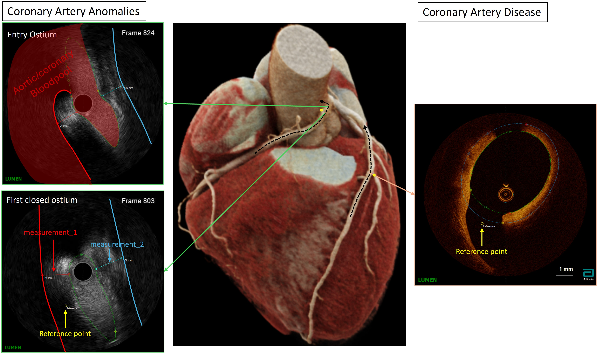
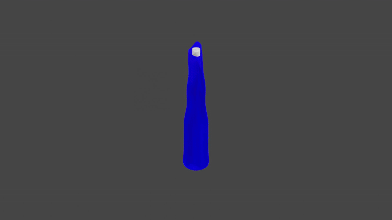
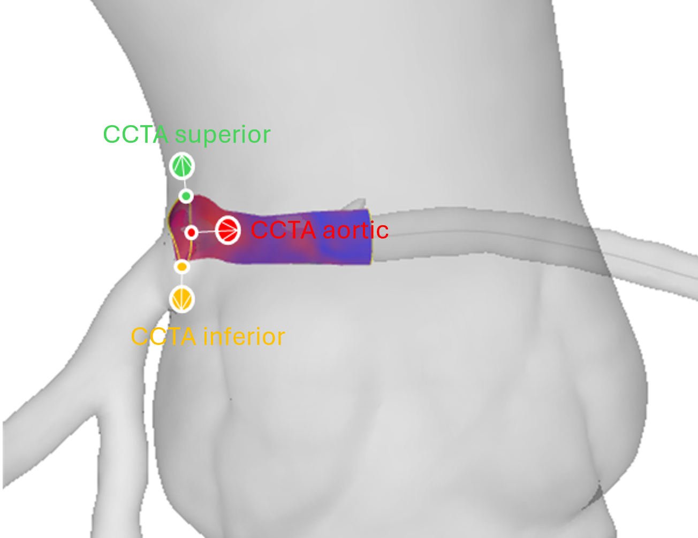

.. note::

    Also download the example data and jupyter notebooks to follow this tutorial step-by-step.
    Use the direct download link:
    `examples.zip <https://github.com/yungselm/multimoda-rs/releases/latest/download/examples.zip>`_
    (SHA256: ``d11ebc7607f43ab4571fb51c9ac9178caac57774cf5d97f4f068ace4eb070fee``)

    Alternatively, browse all releases on the
    `Github Releases page <https://github.com/yungselm/multimoda-rs/releases>`_.

Tutorial - Intravascular Module
================================

This step-by-step tutorial demonstrates how to:

- How to prepare the segmentation data for best results
- Run the workflow from csv files (AIVUS-CAA outpu)
- Run the workflow by building input data from numpy arrays
- Finetuning of alignment algorithms (in-depth parameter explanation)
- Alignment with a centerline
- Saving everything as .obj files
- Utility functions to link to numpy
- Class methods

1. General note on segmentation preparation
^^^^^^^^^^^^^^^^^^^^^^^^^^^^^^^^^^^^^^^^^^^^
The package is designed to work with segmented intravascular images from either IVUS or OCT. 
Segmentation must, however, follow specific conventions to ensure optimal results. 
The package was developed with coronary artery anomalies in mind, and specifically anomalous aortic origin of a coronary artery (AAOCA) 
with an intramural course, in which part of the vessel traverses the aortic wall. In all cases, 
it is essential to define a correct anatomical reference point to enable subsequent co-registration with the CCTA geometry (see :numref:`fig-dataprep`).

   Reference point placement for intravascular segmentation data preparation.

For coronary artery disease (CAD), it is sufficient to identify a bifurcation and place the reference point at the ostium of the side branch.
For AAOCA, it is important to first identify the most proximal fully closed lumen contour in both diastole and systole, and subsequently place the reference point at the centre of the vessel on the aortic side
(see also `True pulsatile lumen visualization in coronary artery anomalies using controlled transducer pullback and automated IVUS segmentation <https://www.jacc.org/doi/10.1016/j.jaccas.2025.104741>`_).

**Rationale for the four processing modes.**
The four alignment modes — *full*, *double-pair*, *single-pair*, and *single* — reflect the number of distinct geometric states that a given clinical question requires.
In a standard controlled-speed IVUS pullback, each anatomical position along the vessel is sampled repeatedly across cardiac cycles.
When pullbacks are acquired under both rest and stress conditions, each position is represented by four independent geometric states:
rest-diastole, rest-systole, stress-diastole, and stress-systole.
This is particularly relevant in AAOCA, where the intramural segment undergoes a complex, phase- and load-dependent deformation that can only be fully characterised by comparing all four states simultaneously (*full* mode).

An important practical consequence is that heart rate differs between rest and stress.
Because the catheter is withdrawn at a constant speed, a higher heart rate during stress results in a greater number of cardiac cycles — and thus a greater number of diastolic-systolic pairs — per unit of pullback length.
Consequently, the axial inter-frame spacing is effectively compressed at stress relative to rest, and the two pullbacks must be resampled to a common z-grid before any cross-condition comparison can be made.
The alignment algorithms in this package account for this discrepancy automatically.

Although the *full* mode was designed with AAOCA in mind, all four modes are directly applicable to other clinical contexts.
In coronary artery disease, for example, *single-pair* mode is well suited to comparing diastolic and systolic frames within a single pullback, while *single* mode supports standalone geometry reconstruction for pre- or post-intervention assessment.
The *double-pair* mode is appropriate whenever two independent pullbacks must be compared (e.g., pre- vs. post-stenting, or two different patients) without the additional stress-rest dimension.

2. Workflow csv files
^^^^^^^^^^^^^^^^^^^^^^

.. note::

    This workflow is based on the output of the `AIVUS <https://github.com/AI-in-Cardiovascular-Medicine/AIVUS-CAA>`_ software.
    The preferred workflow for a more general workflow is to directly use numpy arrays, which can be easily created from the csv files, 
    but also from any other source. The csv workflow is provided for users who are already using AIVUS and want to quickly apply the package to their data.

After pip installing or locally building the package, install it in the familiar way.

.. code-block:: python

    import multimodars as mm

To run the whole workflow from .csv files with either :func:`multimodars.from_file_full`, :func:`multimodars.from_file_doublepair`, 
:func:`multimodars.from_file_singlepair` or :func:`multimodars.from_file_single` the following requirements have to be met.
Files should be named ``diastolic_contours.csv``, ``systolic_contours.csv``,
``diastolic_reference_points.csv`` and ``systolic_reference_points.csv`` depending on the required analysis.
Every file should be structured in the following way (no headers):

+------------+----------+----------+----------+
| (frame id) | (x (mm)) | (y (mm)) | (z (mm)) |
+------------+----------+----------+----------+
| ...        | ...      | ...      | ...      |
+------------+----------+----------+----------+
| 771        | 2.4862   | 6.7096   | 24.5370  |
+------------+----------+----------+----------+
| 771        | 2.5118   | 6.7017   | 24.5370  |
+------------+----------+----------+----------+
| 771        | 2.5370   | 6.6936   | 24.5370  |
+------------+----------+----------+----------+
| ...        | ...      | ...      | ...      |
+------------+----------+----------+----------+

*The first column contains the frame index of the pullback; each row represents one contour point with its corresponding x, y, and z coordinates.*

To acquire meaningful measurement data, the coordinates should be provided in **mm or another SI unit** instead of pixel values.

Optionally a record file can be provided `combined_sorted_manual.csv`, which should have the following structure, here the first column should contain the desired frame order and "measurement_1"
represent the thickness of the wall between aorta and coronary and "measurement_2" for the thickness between pulmonary artery and coronary (position just for demonstration) (see :numref:`fig-dataprep`). This is based on the
output of the `AIVUS-CAA software <https://github.com/AI-in-Cardiovascular-Medicine/AIVUS-CAA/>`_:

+-----------------+---------------+---------------+---------------+---------------+
| frame           | (position)    |   phase       | measurement_1 | measurement_2 |
+-----------------+---------------+---------------+---------------+---------------+
| 18              |  23.99        |       D       |               |               |
+-----------------+---------------+---------------+---------------+---------------+
| 37              |  22.79        |       D       |               |     2.35      |
+-----------------+---------------+---------------+---------------+---------------+
| 212             |  21.59        |       D       |     1.38      |     2.34      |
+-----------------+---------------+---------------+---------------+---------------+
| 94              |  20.39        |       D       |     1.38      |     2.11      |
+-----------------+---------------+---------------+---------------+---------------+
|  ...            |    ...        |     ...       |     ...       |     ...       |
+-----------------+---------------+---------------+---------------+---------------+
| 47              |  18.78        |       S       |               |               |
+-----------------+---------------+---------------+---------------+---------------+

The full workflow comparing rest vs. stress and diastole vs. systole can be run with :func:`multimodars.from_file_full`:

.. code-block:: python

    rest, stress, dia, sys, _ = mm.from_file_full(
        input_path_ab="ivus_rest",
        input_path_cd="ivus_stress",
        step_rotation_deg=0.1,
        range_rotation_deg=90,
        image_center=(4.5, 4.5),
        radius=0.5,
        n_points=20,
        write_obj=True,
        watertight=False,
        contour_types=[mm.PyContourType.Lumen, mm.PyContourType.Catheter, mm.PyContourType.Wall],
        output_path_ab="output/rest",
        output_path_cd="output/stress",
        output_path_ac="output/diastole",
        output_path_bd="output/systole",
        interpolation_steps=28,
    )

The workflow can also be simplified by leaving the default values and only providing input and output paths, here e.g. for a singlepair:

.. code-block:: python

    rest, (dia_logs, sys_logs) = mm.from_file_singlepair(
        input_path="ivus_rest",
        output_path="output/rest",
    )

3. Workflow numpy arrays
^^^^^^^^^^^^^^^^^^^^^^^^^
To call :func:`multimodars.from_array_full`, :func:`multimodars.from_array_doublepair`, :func:`multimodars.from_array_singlepair` 
or :func:`multimodars.from_array_single` the contours and reference point from the geometry must be packed into
a :class:`multimodars.PyInputData` object first. We assume that ``before_arr``, ``after_arr``, ``before_ref`` and ``after_arr``
are all Numpy arrays with N(4, ) shape:

.. code-block:: python

    before_input_data = mm.numpy_to_inputdata(
        lumen_arr=before_arr,
        ref_point=before_ref,
        record=None,
        diastole=True,
        label="prestent",
    )

    after_input_data = mm.numpy_to_inputdata(
        lumen_arr=after_arr,
        ref_point=after_ref,
        record=None,
        diastole=True,
        label="poststent",
    )

    pair, _ = mm.from_array_singlepair(
        input_data_a=before_input_data,
        input_data_b=after_input_data,
        label="singlepair",
        output_path="output/stent_comparison",
        step_rotation_deg=0.01,
        range_rotation_deg=30,
    )

4. Finetuning of alignment algorithms (in-depth parameter explanation)
^^^^^^^^^^^^^^^^^^^^^^^^^^^^^^^^^^^^^^^^^^^^^^^^^^^^^^^^^^^^^^^^^^^^^^^
The alignment algorithm co-registers adjacent intravascular frames by translating each frame to a common centroid and subsequently identifying the optimal rotation angle that minimises the Hausdorff distance between consecutive contours. Computational efficiency is achieved through a hierarchical coarse-to-fine angular search combined with multi-threaded processing of the different geometric states (see :numref:`fig-align`).

.. figure:: ../paper/figures/Figure4.jpg
   :name: fig-align
   :alt: Alignment algorithm using translation and rotation
   :align: center
   :width: 400px

   Schematic of the translation and rotation alignment algorithm, illustrating the rotation search range, step size, image centre, and catheter radius parameters.

This section provides an in-depth discussion of each parameter, using :func:`multimodars.from_array_full` as a reference. The only required inputs are the four ``PyInputData`` objects (``input_data_a`` through ``input_data_d``); all remaining parameters have sensible defaults.

.. code-block:: python

    import multimodars as mm

    rest, stress, diastole, systole, (log_rest, log_stress, log_diastole, log_systole) = mm.from_array_full(
        input_data_a=diastole_rest_input,    # REST diastole
        input_data_b=systole_rest_input,     # REST systole
        input_data_c=diastole_stress_input,  # STRESS diastole
        input_data_d=systole_stress_input,   # STRESS systole
        step_rotation_deg=0.5,
        range_rotation_deg=90,
        sample_size=500,
        image_center=(4.5, 4.5),
        radius=0.5,
        n_points=20,
        write_obj=True,
        watertight=True,
        contour_types=[mm.PyContourType.Lumen, mm.PyContourType.Catheter, mm.PyContourType.Wall],
        output_path_ab="output/rest_results",
        output_path_cd="output/stress_results",
        output_path_ac="output/diastole_results",
        output_path_bd="output/systole_results",
        interpolation_steps=0,
        bruteforce=False,
        smooth=True,
        postprocessing=True,
    )

**Parameter reference:**

- ``step_rotation_deg`` and ``range_rotation_deg``: define the angular search space and its resolution. The algorithm tests candidate rotations from ``−range_rotation_deg`` to ``+range_rotation_deg`` in increments of ``step_rotation_deg``. In the example above, the full range of ±90° is explored at 0.5° resolution. When the approximate orientation is already known, reducing ``range_rotation_deg`` (e.g. to 30°) substantially reduces computation time without sacrificing accuracy.

- ``sample_size``: contours are downsampled to at most this many points prior to Hausdorff distance computation. Contours with fewer points are left unchanged. The default of 500 points is appropriate for most IVUS datasets; increasing this value improves accuracy at the cost of computation time.

- ``image_center``, ``radius``, and ``n_points``: these three parameters define the synthetic catheter used as an additional rotational anchor (see :numref:`fig-align`). ``image_center`` specifies the catheter centre as ``(x, y)`` in mm, ``radius`` the catheter radius in mm, and ``n_points`` the number of points sampled on the catheter circle.

.. note::

    ``n_points`` controls the relative weight of the catheter position versus the lumen contour shape during alignment. A larger value makes the catheter centroid more influential, which benefits round, featureless contours where Hausdorff distances alone are ambiguous across different rotation angles. For geometrically distinct contours (e.g. severely stenotic or anomalous segments), a small value or even ``n_points=0`` is more appropriate.

- ``write_obj`` and ``watertight``: when ``write_obj=True``, triangle meshes are constructed from the aligned contour points and exported as Wavefront OBJ files, together with a material file (.mtl) and a UV map encoding the per-vertex deformation relative to geometry A. Setting ``watertight=True`` closes the proximal and distal ends of each mesh by connecting the boundary contour points to a central cap vertex.

- ``contour_types``: specifies which contour layers are exported. Three types are supported: ``Lumen`` (the vessel lumen boundary), ``Catheter`` (the synthetic catheter circle defined by ``image_center``, ``radius``, and ``n_points``), and ``Wall`` (the aortic wall representation). The wall is derived from ``measurement_1`` in the record file when provided; otherwise a uniform 1 mm outward offset is applied.

- ``output_path_ab``, ``output_path_cd``, ``output_path_ac``, and ``output_path_bd``: output directories for the four cross-aligned geometry pairs. The mapping between input slots and output paths is:

.. parsed-literal::

                      ``output_path_ac`` (Diastole: a vs. c)
            ┌──────────────────────────────────────────┐
            ▼                                          ▼
   **a** REST diastole                      **c** STRESS diastole
         │  ``output_path_ab`` (Rest: a+b)        │  ``output_path_cd`` (Stress: c+d)
         ▼                                        ▼
   **b** REST systole                       **d** STRESS systole
            └──────────────────────────────────────────┘
                      ``output_path_bd`` (Systole: b vs. d)

- ``interpolation_steps``: number of intermediate meshes to generate between paired states (e.g. rest and stress). This is useful for producing animations that visualise dynamic deformation. For example, 28 interpolation steps at 30 fps yields approximately one second of video per transition, each frame carrying its own UV deformation map:

- ``bruteforce``: when ``True``, the complete angular range is swept at the specified ``step_rotation_deg`` without hierarchical refinement. Not recommended for routine use (:math:`\mathcal{O}(n^3)` complexity).

- ``smooth``: applies a 3-point moving average to each contour after alignment to reduce discretisation artefacts. Recommended for all datasets.

- ``postprocessing``: equalises the axial frame spacing within and between pullbacks after alignment. Recommended whenever the two pullbacks were acquired at different heart rates, as this causes differing inter-frame distances along the vessel axis.

5. Alignment with a centerline
^^^^^^^^^^^^^^^^^^^^^^^^^^^^^^^
A centerline can be created directly from points. Points don't need any index, only x-, y- and z-coordinates:

+------------+------------+------------+
|     ...    |     ...    |     ...    |
+------------+------------+------------+
|   12.6579  |  -199.7824 |   1751.519 |
+------------+------------+------------+
|   13.0847  |  -200.3508 |   1751.8602|
+------------+------------+------------+
|   13.419   |  -200.9894 |   1752.1491|
+------------+------------+------------+
|     ...    |     ...    |     ...    |
+------------+------------+------------+

These could for example be stored in a .csv file and then be converted to a PyCenterline, which also includes the normals connecting the points:

.. code-block:: python

    cl_raw = np.genfromtxt("centerline_raw.csv", delimiter=',')
    centerline = mm.numpy_to_centerline(cl_raw)

As soon as the centerline is created it will be automatically resampled to have the same spacing as the
PyGeometry or PyGeometryPair, which will be aligned with the centerline.

This can either be done with three point alignment (preferred), where one point is corresponding to the reference point
of the PyGeometry (e.g. aortic reference for coronary artery anomalies) and one point indicating the superior position
and another point indicating the inferior position.

The reference contour is then best matched to these three points, all the leading points on the centerline are removed
and the spacing is adjusted to match the z-spacing of the PyGeometry.

.. code-block:: python

    aligned_geometry, resampled_cl = mm.align_three_point(
        centerline=centerline,
        geometry_pair=rest,
        aortic_ref_pt=(12.2605, -201.3643, 1751.0554),
        upper_ref_pt=(11.7567, -202.1920, 1754.7975),
        lower_ref_pt=(15.6605, -202.1920, 1749.9655),
        write=True,
        watertight=False,
        interpolation_steps=0,
    )

If you want to additionally use a pointcloud to finetune the three point alignment, by utilizing
Hausdorff distances between the pointcloud and the geometry, the following function can be used:

.. code-block:: python

    aligned, resampled_cl = mm.align_combined(
        centerline,
        rest,
        (12.2605, -201.3643, 1751.0554),
        (11.7567, -202.1920, 1754.7975),
        (15.6605, -202.1920, 1749.9655),
        results["rca_points"],  # [(x, y, z), ...]
        angle_range_deg=10.0,
        write=True,
        watertight=True,
        output_dir="test",
    )

6. Saving everything as .obj files
^^^^^^^^^^^^^^^^^^^^^^^^^^^^^^^^^^^
While every wrapper function allows to directly save the created geometries as .obj files (with optional interpolation),
it is also possible to save any created geometry directly to an object file. The ``to_obj`` function can automatically
detect the type of the object, and can be applied to PyGeometryPair, PyGeometry.

.. code-block:: python

    mm.to_obj(
        geometry,
        "output/dir",
        watertight=False,
        contour_types=[mm.PyContourType.Lumen, mm.PyContourType.Catheter],
        filename_prefix="aligned",
    )

7. Utility functions to link to numpy
^^^^^^^^^^^^^^^^^^^^^^^^^^^^^^^^^^^^^^
Any python object can be returned as numpy array, in case of PyGeometry and PyGeometryPair the different parts
will be returned as a dictionary with their corresponding arrays (contours, catheters, walls, reference):

.. code-block:: python

    stress_dia_arr, stress_sys_arr = mm.to_array(stress)
    aligned_arr = mm.to_array(aligned)
    centerline_arr = mm.to_array(cl_resampled)
    ostial_contour_arr = mm.to_array(rest.geom_a.frames[-1].lumen)

Returns::

    np.ndarray
        For PyContour or PyCenterline:
        A 2D array of shape (N, 4), where each row is (frame_index, x, y, z).

    dict[str, np.ndarray]
        For PyGeometry:
        A dictionary with keys ["contours", "catheters", "walls", "reference"],
        each containing a 2D array of shape (M, 4), where M is the number of points in that layer.
        "reference" is a (1, 4) array or (0, 4) if missing.

    Tuple[dict[str, np.ndarray], dict[str, np.ndarray]]
        For PyGeometryPair:
        A tuple of two dictionaries (one for diastolic, one for systolic), each in the same format
        as returned for a single PyGeometry.

8. Class methods
^^^^^^^^^^^^^^^^^
PyContour
--------------
After creating a PyGeometry several utility methods are provided. If a new contour is created from points
and no centroid is available it can easily be calculated, additionally can the closest opposite points
and the farthest points be identified:

.. code-block:: python

    contour.compute_centroid()
    (p1, p2), distance = contour.find_closest_opposite()
    (p1, p2), distance = contour.find_farthest_points()

For every contour the area and elliptic ratio can be returned. **CAVE:** units are calculated from the original
image spacing, if contours were provided in pixels no meaningful result will be returned.

.. code-block:: python

    area = contour.get_area()
    elliptic_ratio = contour.get_elliptic_ratio()

Contours can also be manipulated, however for additional safety operations are not performed in place
but rather return a new contour that can then be set to the original position if needed.

.. code-block:: python

    contour = geometry.frames[2].lumen
    contour_rot = contour.rotate(20)
    contour_trsl = contour_rot.translate((0.0, 1.0, 2.0))
    geometry.set_cont(2, contour_trsl)

PyGeometry/PyGeometryPair
-------------------------
The PyGeometry has some additional functionality, contours inside can be smoothed with a
moving average and rotation and translation can be performed on Geometry level

.. code-block:: python

    geometry.smooth_contours(window_size=3)
    geom_rot = geometry.rotate(20)
    geom_trsl = geom_rot.translate((0.0, 1.0, 2.0))

Additionally there is a summary function to return minimal lumen area, maximum stenosis, and stenosis length in mm
as a tuple for either PyGeometry or PyGeometryPair. For PyGeometryPair additionally a map with lumen area and elliptic
ratio for either diastole and systole are provided. These results can then easily be translated to a numpy array.

.. code-block:: python

    geometries.get_summary()
    geometries.geom_a.get_summary()
    geometries.geom_b.get_summary()
    # turn summary map to numpy array
    _, deformation = geometries.get_summary()
    deform_array = np.array(deformation)

Returns::

    Geometry "Diastole":
    MLA [mm²]: 5.57
    Max. stenosis [%]: 58
    Stenosis length [mm]: 2.99

    Geometry "Systole":
    MLA [mm²]: 4.71
    Max. stenosis [%]: 69
    Stenosis length [mm]: 11.20

    +----+----------+-----------+----------+-----------+-------+
    | id | area_dia | ellip_dia | area_sys | ellip_sys |   z   |
    +----+----------+-----------+----------+-----------+-------+
    | 0  | 12.20    | 1.23      | 15.14    | 1.03      | 0.75  |
    | 1  | 12.68    | 1.20      | 14.99    | 1.04      | 1.49  |
    | 2  | 13.09    | 1.16      | 14.85    | 1.05      | 2.24  |
    | 3  | 13.24    | 1.13      | 14.51    | 1.04      | 2.99  |
    | 4  | 13.26    | 1.11      | 13.48    | 1.03      | 3.73  |
    | 5  | 13.22    | 1.12      | 11.78    | 1.06      | 4.48  |
    | 6  | 13.07    | 1.11      | 9.50     | 1.11      | 5.23  |
    | 7  | 12.70    | 1.10      | 7.86     | 1.13      | 5.97  |
    | 8  | 12.46    | 1.10      | 6.87     | 1.18      | 6.72  |
    | 9  | 12.37    | 1.09      | 6.62     | 1.18      | 7.46  |
    | 10 | 12.28    | 1.08      | 6.28     | 1.21      | 8.21  |
    | 11 | 12.04    | 1.09      | 5.91     | 1.26      | 8.96  |
    | 12 | 11.77    | 1.12      | 5.56     | 1.32      | 9.70  |
    | 13 | 11.06    | 1.14      | 5.58     | 1.37      | 10.45 |
    | 14 | 10.09    | 1.12      | 5.96     | 1.48      | 11.20 |
    | 15 | 8.93     | 1.11      | 6.31     | 1.59      | 11.94 |
    | 16 | 7.85     | 1.14      | 6.35     | 1.87      | 12.69 |
    | 17 | 6.80     | 1.16      | 5.81     | 2.27      | 13.44 |
    | 18 | 5.99     | 1.30      | 5.29     | 2.76      | 14.18 |
    | 19 | 5.57     | 1.55      | 5.25     | 2.97      | 14.93 |
    | 20 | 5.86     | 1.78      | 5.42     | 2.88      | 15.68 |
    | 21 | 6.04     | 1.76      | 5.45     | 2.79      | 16.42 |
    | 22 | 6.55     | 1.53      | 5.02     | 2.66      | 17.17 |
    | 23 | 7.22     | 1.43      | 4.71     | 2.56      | 17.92 |
    +----+----------+-----------+----------+-----------+-------+
