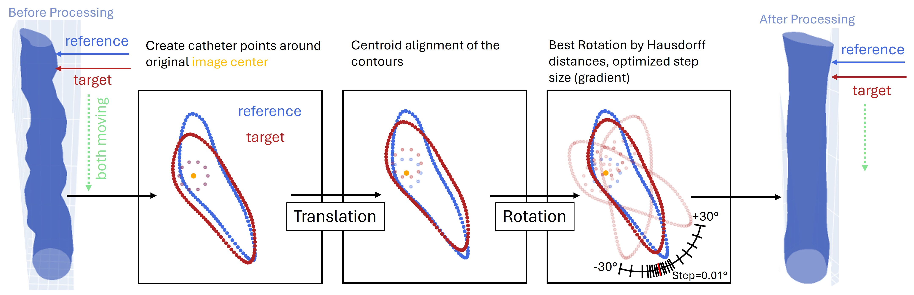

# Summary

Coronary artery anomalies (CAAs) and coronary artery disease (CAD) require precise morphological and functional assessment for diagnosis and treatment planning. Cardiac computed tomography angiography (CCTA) provides a comprehensive 3D coronary anatomy but lacks the sub-millimeter resolution and dynamic tissue detail available from intravascular imaging, such as intravascular ultrasound (IVUS) and optical coherence tomography (OCT). 

The `multimodars` package is a general-purpose toolkit that registers high-resolution intravascular pullbacks to CCTA-derived centerlines, producing locally enhanced fusion 3D vessel representations. Developed initially to quantify dynamic lumen changes in CAAs, the toolkit produces high-fidelity models suitable for visualization, geometric analysis, and patient-specific modelling. It implements four alignment paradigms (full, double-pair, single-pair, single) to compare pullbacks acquired under different haemodynamic states (e.g., rest vs. pharmacologic stress) or at different clinical timepoints (e.g., pre- vs. post-stenting). `Multimodars` targets deterministic, reproducible multimodal fusion for both specialized CAA research and general CAD applications [@stark2025true].

# Statement of Need

Building reliable 3D coronary models requires combining complementary imaging modalities. Intravascular imaging offers exceptional local resolution but lacks whole-vessel context and 3D orientation. CCTA provides the global 3D geometry but suffers from limited spatial resolution and artifacts like blooming. `Multimodars` fills a critical gap for researchers in **cardiac imaging**, **interventional cardiology**, and **biomedical engineering** who require high-fidelity lumen models for:

* Automated quantification of vessel deformation under stress.
* Computational Fluid Dynamics (CFD) and Fluid-Structure Interaction (FSI) simulations.
* Digital twin solutions.

The package accepts CSV and NumPy inputs, including data formats produced by the [AIVUS-CAA](https://github.com/AI-in-Cardiovascular-Medicine/AIVUS-CAA) software [@stark2025automated], providing a standardized pipeline from raw image segmentation to final 3D fusion.

{width=80%}

# State of the Field

Prior research has established the clinical value of CCTA/intravascular fusion [@van20103d; @wu20203d; @ilic2025comprehensive; @bourantas2013new; @boogers2012automated], but several barriers remain:
1. **Proprietary Constraints**: Most existing fusion solutions are tied to proprietary vendor hardware or closed-source commercial workstations, limiting academic transparency.
2. **Multi-state Gap**: No existing open-source toolkit is specifically tailored for **multi-state** analysis (comparing rest vs. stress or pre- vs. post-intervention states) while maintaining a deterministic alignment across pullbacks.

## Build vs. Contribute Justification
While packages like `trimesh` or `SimpleITK` provide general mesh and registration utilities, they do not offer the domain-specific coronary alignment logic (e.g., cumulative rotation propagation to preserve vessel torsion) required for intravascular imaging. `Multimodars` was built as a standalone toolkit because existing registration libraries lack the specific coordinate mapping and multiscale search algorithms optimized for curvilinear cardiac centerlines.

# Software Design

`Multimodars` is built as a `maturin` project, wrapping a high-performance Rust core with a Python interface. 

## Architectural Choices and Trade-offs
We chose **Rust** for the core backend to leverage its memory safety and hierarchical data parallelism (via the `Rayon` crate). This allows the toolkit to handle the significant computational load of multiscale angular searches across hundreds of image frames without the performance limitations found in pure Python implementations. 

The data model uses a compact typed structure (PyContourPoint, PyContour, PyGeometry) that maps losslessly to (N,4) NumPy arrays (frame_id, x, y, z). This choice balances the performance of low-level data structures with the usability of the Python data science ecosystem.

{width=80%}

## Algorithms

Alignment is a two-stage pipeline producing spatially and rotationally consistent mappings both within pullbacks (intra-pullback) and between pullbacks (inter-pullback). It further aligns 3D models with a CCTA derived centerline and adjusts the CCTA mesh to match the dimensions of the intravascular 3D model.

- **Intra-pullback:** The proximal frame is the rotational reference. Sequentially, each proximal→distal neighbour is aligned by centroid translation and a rotation search minimizing a point-set distance derived from directed Hausdorff distances. Rotation employs a multiscale angular search (coarse → fine, e.g., 1° → 0.1° → 0.01°) with cumulative rotation propagation to preserve vessel torsion (See \autoref{fig:algo}). Naive brute-force complexity scales as $O(n \times \frac{R}{S} \times m^2)$ (n = frames, m = points per contour, R = angular range, S = step size). By fixing contour size (downsampling) and reducing the angular search via multiscale refinement, the pipeline attains effective complexity $O(n \times (R + c) \times m^2)$ for small S, making runtime less sensitive to step granularity while preserving alignment accuracy.

- **Inter-pullback and CCTA fusion:** Inter-pullback alignment harmonizes distal centroids, averages slice spacing to align z-coordinates, and applies a rigid rotation to minimize mean directed distances across corresponding frames; ellipticity-weighted similarity prioritizes non-round stenotic slices. 

- **CCTA-Centerline alignment:** The `multimodars` package implements a three-point (aortic-, cranial- and caudal direction) anatomical registration and a manual alignment mode. It additionally utilizes Hausdorff distances to CCTA mesh points for ambiguous anatomies: centerlines are resampled to contour spacing, centroids are translated to matched points, normals are aligned by cross-product computations, and an optional interpolated UV-mapped mesh is produced for visualization and downstream modeling.

- **CCTA-labeling:** For normal coronary anatomy, CCTA mesh points are labeled using a rolling-sphere sweep along the coronary centerline. For CAAs, where the vessel may run very close to or within the aortic wall, this is followed by an occlusion-based cleanup: rays are cast from the aortic centerline toward the coronary centerline; ray–triangle intersections identify occluding aortic wall regions, and mesh points close to these surfaces are removed. This yields a deterministic and anatomically consistent coronary lumen representation.

- **CCTA-border adjustments:** Given the higher resolution of intravascular imaging, the aligned intravascular anatomy is treated as the anatomical ground truth. CCTA dimensions are adjusted to fit the proximal and distal ends of the vessel. For CAAs, the aorta is additionally adjusted to match the measured intramural wall.

{width=80%}

## Performance and parallelisation

Rust (Rayon) provides hierarchical data parallelism and SIMD-enabled coordinate transforms. Point rotations and nearest-neighbour searches parallelize across cores; independent pullbacks and frames are processed concurrently when dependencies allow. Typical production workflows downsample contours to 200–500 points/frame to balance sub-pixel accuracy and compute.

Empirical performance on a 16-core CPU: an OCT pullback with 280 frames and a rotation search range of $\pm3°$ (final accuracy 0.01°) saw alignment time reduced from **$~150 s$** to **$~18 s$** with the optimized multiscale search. 

{width=80%}

## Implementation, reproducibility and usage

The core is implemented in Rust and exposed to Python via PyO3; packaging uses `maturin` and the package is available on PyPI. The NumPy-centric API maps directly to (N,4) arrays; the project includes example notebooks, sample data (including [AIVUS-CAA](https://github.com/AI-in-Cardiovascular-Medicine/AIVUS-CAA) [@stark2025automated]) and CI tests. Documentation and tutorials are hosted on ReadTheDocs ([ReadTheDocs](https://multimoda-rs.readthedocs.io/en/latest/)).

# Research impact statement

`Multimodars` was motivated by the need to quantify dynamic lumen deformation in CAAs, where rest/stress and pulsatile comparisons are diagnostically critical. Deterministic, high-resolution fusion enables quantitative assessment of stress-induced deformation and supports patient-specific haemodynamic modeling. These methods also support longitudinal CAD analyses (e.g., pre-/post-stent). In a case report accepted in JACC: Case Reports, we successfully implemented this fusion approach to unveil a distinct compression pattern not visible in IVUS or CCTA alone. We hope to foster a research community that leverages `multimodars` to standardize multimodal coronary fusion and accelerate the development of personalized interventional or computational strategies.

# AI usage disclosure

No generative AI was used for architectural design or core algorithms. Generative AI was used for creating documentation and docstrings, bug fixing, and minor inline code changes.
For this manuscript generative AI was only used for grammatical changes.

# Acknowledgements

None

# References