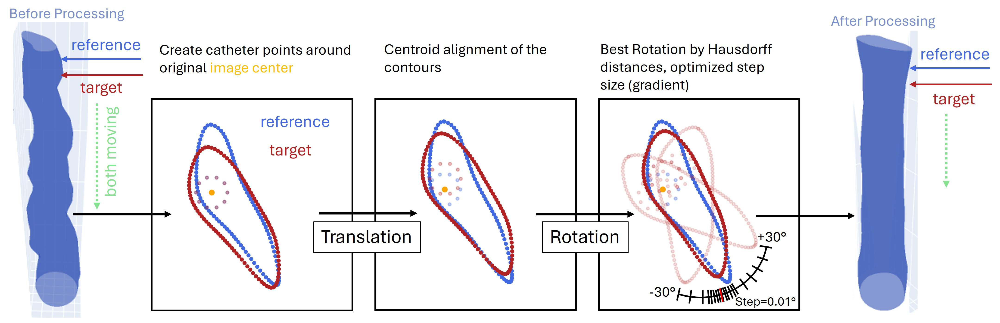

# Summary
Coronary artery anomalies (CAAs) and coronary artery disease (CAD) require precise morphological and functional assessment for diagnosis and treatment planning. Cardiac computed tomography angiography (CCTA) provides comprehensive 3D coronary anatomy but lacks the sub-millimetre resolution and dynamic tissue detail available from intravascular imaging (intravascular ultrasound [IVUS], optical coherence tomography [OCT]). Developed initially to quantify dynamic lumen changes in CAAs, `multimodars` is a general-purpose toolkit that registers high-resolution intravascular pullbacks to CCTA-derived centerlines, producing locally enhanced fusion 3D vessel representations for visualization, geometric analysis, and patient-specific modelling. The toolkit implements four alignment paradigms (full, double-pair, single-pair, single) to compare pullbacks acquired under different haemodynamic states (e.g., rest vs. pharmacologic stress) or at different timepoints (e.g., pre- vs. post-stenting). `multimodars` targets deterministic, reproducible multimodal fusion for CAA research and general CAD applications. [@stark2025true; @stark2025ivus] (see \autoref{fig:aim}).

# Statement of need
Combining complementary imaging modalities is critical to build reliable 3D coronary models: intravascular imaging gives sub-millimetre resolution but limited whole-vessel context, while CCTA supplies 3D geometry but suffers from limited spatial resolution and artefacts (e.g., blooming). Prior work demonstrated intravascular/CCTA fusion [@van20103d; @kilic2020evolution; @wu20203d; @bourantas2013new], yet no open, flexible toolkit is tailored for **multi-state** analysis (rest/stress, pre-/post-stenting) while offering deterministic behaviour, high performance, and easy pipeline integration. `multimodars` addresses this gap with deterministic alignment algorithms, a compact NumPy-centred data model, and an optimised Rust backend suitable for scalable, reproducible experiments. The package accepts CSV/NumPy inputs including data formats produced by the [AIVUS-CAA](https://github.com/AI-in-Cardiovascular-Medicine/AIVUS-CAA) software [@stark2025automated].

{width=80%}

# Features
`multimodars` combines a Rust core with a compact typed Python data model (PyContourPoint, PyContour, PyGeometry, PyGeometryPair) that maps losslessly to (N,4) NumPy arrays (frame_id, x, y, z) (see Figure \autoref{fig:data}). Key capabilities: round-trip CSV/NumPy I/O, optional OBJ export with deformation mapping and UV coordinates, centroiding, area and ellipticity metrics, smoothing, reordering, rigid transforms, stenosis summaries, and mesh export. Processing modes return either all four geometry pairs (full), pulsatile deformation in two haemodynamic states (double-pair), any pair of states (single-pair), or intra-pullback alignment only (single). Users tune downsampling and angular resolution to trade accuracy for throughput; computational hotspots are parallelised.

{width=80%}

# Algorithms
Alignment is a two-stage pipeline producing spatially and rotationally consistent mappings both within pullbacks (intra-pullback) and between pullbacks (inter-pullback).

- **Intra-pullback:** The proximal frame is the rotational reference. Sequentially, each proximal→distal neighbour is aligned by centroid translation and a rotation search minimizing a point-set distance derived from directed Hausdorff distances. Rotation employs a multiscale angular search (coarse → fine, e.g., 1° → 0.1° → 0.01°) with cumulative rotation propagation to preserve vessel torsion (See \autoref{fig:algo}). Naive brute-force complexity scales as $O(n \times \frac{R}{S} \times m^2)$ (n = frames, m = points per contour, R = angular range, S = step size). By fixing contour size (downsampling) and reducing the angular search via multiscale refinement, the pipeline attains effective complexity $O(n \times (R + c) \times m^2)$ for small S, making runtime less sensitive to step granularity while preserving alignment accuracy.

- **Inter-pullback and CCTA fusion:** Inter-pullback alignment harmonizes distal centroids, averages slice spacing to align z-coordinates, and applies a rigid rotation to minimize mean directed distances across corresponding frames; ellipticity-weighted similarity prioritizes non-round stenotic slices. For CCTA, `multimodars` implements a three-point anatomical registration and a manual alignment mode for ambiguous anatomies: centerlines are resampled to contour spacing, centroids are translated to matched points, normals are aligned by cross-product computations, and an optional interpolated UV-mapped mesh is produced for visualization and downstream modelling.

{width=80%}

**Clinical impact in CAA and beyond:** `multimodars` was motivated by quantifying dynamic lumen deformation in CAAs, where rest/stress and pulsatile comparisons are diagnostically relevant. Deterministic, high-resolution fusion enables quantitative assessment of stress-induced deformation and supports planning and patient-specific haemodynamic modelling. Identical methods support longitudinal CAD analyses (e.g., pre-/post-stent) and broader cardiovascular research.

# Performance and parallelisation
Rust (Rayon) provides hierarchical data parallelism and SIMD-enabled coordinate transforms. Point rotations and nearest-neighbour searches parallelize across cores; independent pullbacks and frames are processed concurrently when dependencies allow. Typical production workflows downsample contours to 200–500 points/frame to balance sub-pixel accuracy and compute.

Empirical performance (representative benchmark on consumer hardware): on a 16-core CPU, an OCT pullback with 280 frames, a rotation search range of $\pm3°$, and a final angular accuracy of 0.01° saw alignment time reduced from **$~150 s$** (multi-threaded, brutefore search) to **$~18 s$** with the optimized, parallel coarse search (mean frame rotation difference −0.01°). These numbers illustrate practical speedups available by combining downsampling, multiscale search and parallelism; exact timings depend on hardware, parameters and input size.

# Implementation, reproducibility and usage
The core is implemented in Rust and exposed to Python via PyO3; packaging uses maturin and the package is available on PyPI. The NumPy-centric API maps directly to (N,4) arrays; the project ships example notebooks, sample data (including [AIVUS-CAA](https://github.com/AI-in-Cardiovascular-Medicine/AIVUS-CAA) [@stark2025automated]) and CI tests. Documentation and tutorials are hosted on ReadTheDocs ([ReadTheDocs](https://multimoda-rs.readthedocs.io/en/latest/)) to support reproducible workflows. Users can tune downsampling, catheter reconstruction and angular resolution to balance precision and throughput.

# Acknowledgements
None

# References